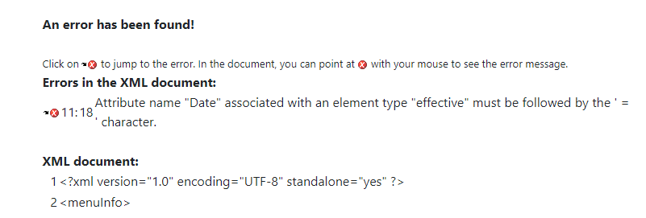
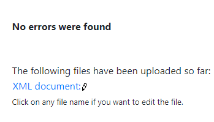
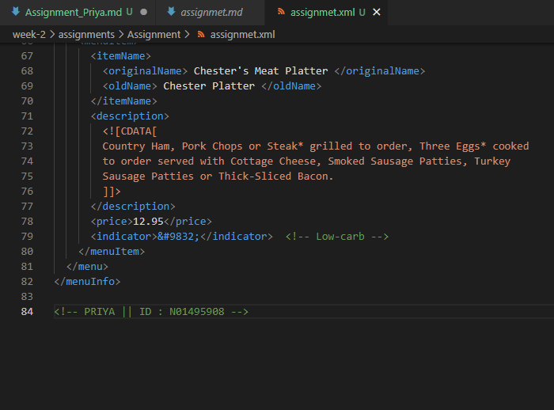
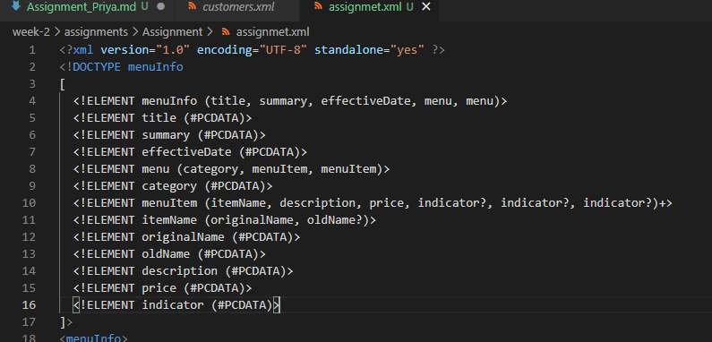
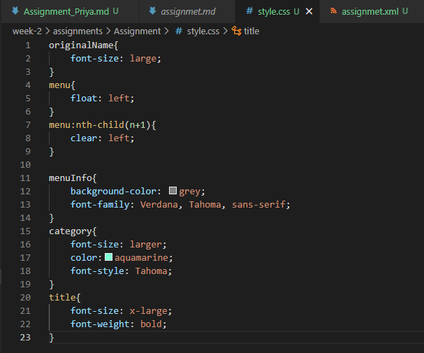

1.  Explain the error and fix it.

It contain a error in line 11 that is there is space in effective and date which should not be there.

2. What is the use of CDATA block in this document?
3.  Add comment line to the end of file which contains you name and student id.

4. Identify prolog, document body, and epilog in the document. Are there any processing instructions?
Prolog

Document body: every single code or tag written in a file is document body.
Epilog: No epilog .
5. Add inline DTD for this document.

6. Verify that file is well-formed and valid.

7. Create `style.css` file and link it to the file. Add the following styles to the .css:

