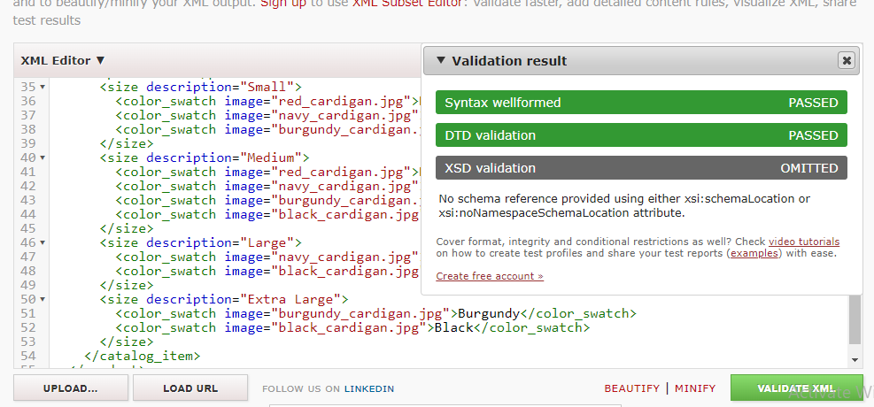
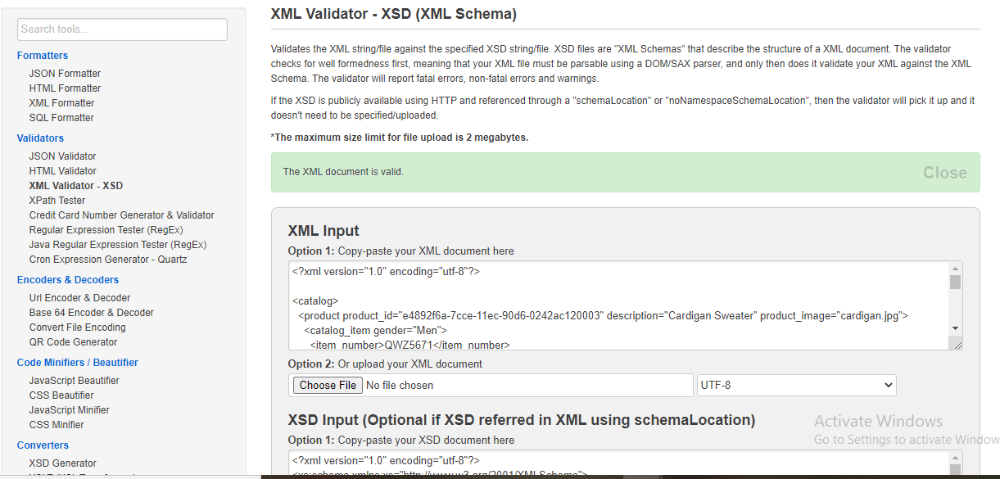

# Assignment

1. Open `week-3/assignments/assignment.xml` in your editor
2. Create DTD for this file and validate it using any of the tools we used

3. Create XSD for this file and validate it using any of the tools we used

4. Explain your thought process for these 2 declarations
We can use our own format for xml file and we can also check the validity in DTD declaration
XSD helps in defining the structure of xml file
Create `week-3/assignments/assignment_YOURNAME.md` and add your theory answers. Add screenshots of each step to the file (Refer `week-1/assignments/evaluation-1.md` on how to add image to md file)
