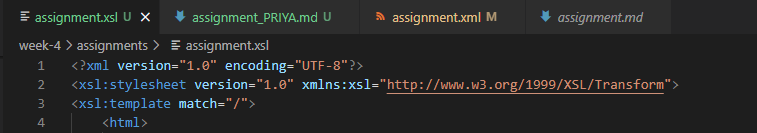
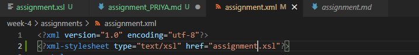
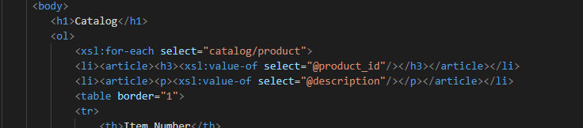
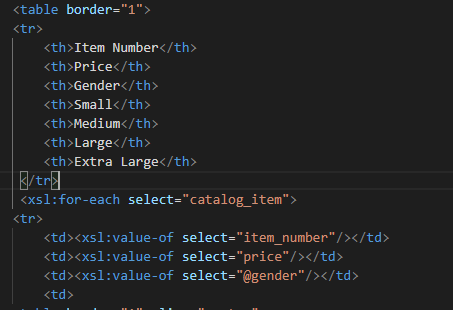
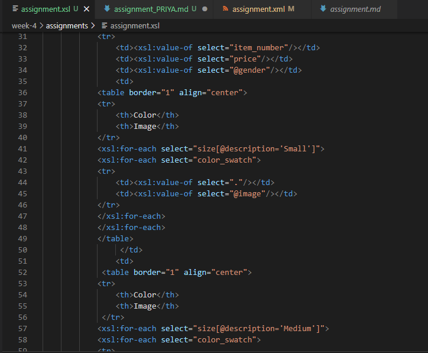
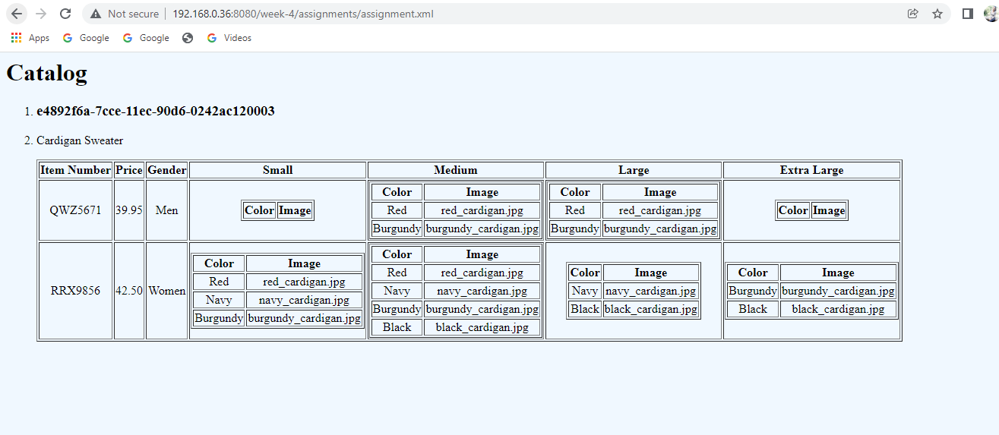

First I created A xml file.

Then add the link of xsl file to the main xml file to link bolth files

Used html list tag to display catlog and render each item as <artical> inside list item tag and used h3 to display product ID, used 
 dispaly production discription

Inside each catalog_item, item number, price, gender and size columns are rendered. Inside in each size columns there is table which consists of two columns 'color' and 'image'. In that table color and image data is rendered for each size according to its description and inside that for each color_swatch.

OUTPUT:
